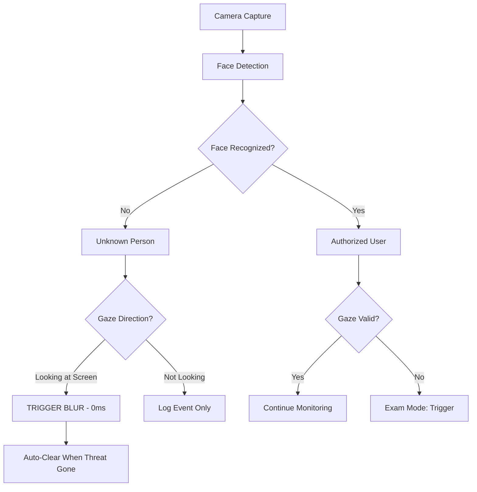

# 🛡️ GazeShield - Advanced Anti-Shoulder Surfing Protection

<p align="center">
  
  
  
</p>

<p align="center">
  <strong>Real-time gaze monitoring and face recognition system that protects your screen from unauthorized viewers</strong>
</p>

---

## 📋 Table of Contents

- [Overview](#-overview)
- [Key Features](#-key-features)
- [How It Works](#-how-it-works)
- [Architecture](#-architecture)
- [Tech Stack](#-tech-stack)
- [Project Structure](#-project-structure)
- [Installation](#-installation)
- [Usage](#-usage)
- [Detection Modes](#-detection-modes)
- [Algorithms Explained](#-algorithms-explained)
- [Screenshots](#-screenshots)
- [Contributing](#-contributing)

---

## 🎯 Overview

**GazeShield** is an intelligent privacy protection system that uses computer vision and machine learning to detect and prevent shoulder surfing attacks in real-time. It monitors who is looking at your screen and automatically blurs the display when unauthorized viewers are detected.

### The Problem
Shoulder surfing is a common attack where someone looks over your shoulder to steal sensitive information like passwords, credit card details, or confidential documents. Traditional solutions require manual activation or have significant delays.

### The Solution
GazeShield provides **instant, automatic protection** with:
- ⚡ **Zero-delay blur** when unauthorized gaze is detected
- 👁️ **Gaze direction analysis** - only blurs when someone is actually looking at YOUR screen
- 🔄 **Auto-clear** - blur removes automatically when threat disappears
- 🖥️ **Cross-tab protection** - works even when you switch browser tabs
- 📱 **Cross-platform** - Available as desktop app (Electron) and web app

---

## ✨ Key Features

### 🔒 Security Features
| Feature | Description |
|---------|-------------|
| **Instant Blur** | Blur triggers immediately (0ms delay) when unauthorized person looks at screen |
| **Gaze Detection** | Analyzes head pose (yaw/pitch) to determine if person is looking at screen |
| **Multi-Face Support** | Detects and handles multiple people in frame |
| **Auto-Clear** | Blur automatically removes when unauthorized person leaves |
| **Cross-Tab Protection** | Electron app maintains protection even when GazeShield tab is not active |
| **Evidence Capture** | Automatic screenshots and video clips of security violations |

### 👥 Access Control Modes
| Mode | Description |
|------|-------------|
| **Single User** | Only registered owner can view screen |
| **Team Mode** | Multiple authorized team members |
| **Member Mode** | Specific invited users only |
| **Exam Mode** | Strict monitoring with faster lock (1-2 seconds) |

### 📊 Analytics & Monitoring
- Real-time threat level indicator (Safe → Warning → High)
- Session timer and owner status tracking
- Event logging with timestamps
- Evidence gallery with screenshots/videos
- Team management interface

---

## 🧠 How It Works



### Detection Pipeline
1. **Face Detection**: HOG (fast) or CNN (accurate) detects faces in frame
2. **Face Recognition**: 128-dimensional encoding matches against registered users
3. **Head Pose Estimation**: Calculates yaw/pitch/roll using 6 landmark points
4. **Gaze Analysis**: Determines if person is looking at screen (yaw ±40°, pitch ≥-30°)
5. **Threat Assessment**: State machine evaluates violation type and severity
6. **Response**: Instant blur + evidence capture + notification

---

## 🏗️ Architecture

### System Components

```
┌─────────────────────────────────────────────────────────────┐
│                     GazeShield System                      │
├─────────────────────────────────────────────────────────────┤
│                                                             │
│  ┌──────────────┐         ┌──────────────┐                │
│  │   Frontend   │         │   Electron   │                │
│  │   (Browser)  │         │  (Desktop)   │                │
│  └──────┬───────┘         └──────┬───────┘                │
│         │                        │                         │
│         └────────┬───────────────┘                         │
│                  │                                         │
│         ┌────────▼─────────┐                               │
│         │   Backend API    │                               │
│         │   (FastAPI)      │                               │
│         └────────┬─────────┘                               │
│                  │                                         │
│         ┌────────▼─────────┐                               │
│         │   PostgreSQL     │                               │
│         │   Database       │                               │
│         └──────────────────┘                               │
│                                                             │
└─────────────────────────────────────────────────────────────┘
```

### Data Flow
1. **Frontend/Electron** → Captures webcam frames
2. **face-api.js** → Detects faces + landmarks in browser
3. **Backend API** → Stores face encodings, logs events, manages teams
4. **Electron Main Process** → Manages blur overlay (cross-tab persistence)
5. **Database** → Persistent storage for users, sessions, events

---

## 💻 Tech Stack

### Frontend & Desktop App
- **React 18/19** - UI framework
- **Vite** - Build tool (fast HMR)
- **Tailwind CSS** - Styling
- **Framer Motion** - Animations
- **React Router DOM** - Routing
- **face-api.js** - Face detection/recognition in browser
- **Axios** - HTTP client
- **JWT Decode** - Authentication

### Desktop App (Electron)
- **Electron 28** - Desktop wrapper
- **electron-store** - Persistent settings
- **electron-log** - Logging
- **Native overlay** - Always-on-top blur window

### Backend
- **FastAPI** - Python web framework
- **SQLAlchemy** - ORM
- **PostgreSQL** - Database
- **OpenCV** - Computer vision (optional)
- **YOLOv8** - Phone detection (optional)
- **passlib[bcrypt]** - Password hashing
- **python-dotenv** - Environment config

---

## 📁 Project Structure

```
GazeShield New/
├── 📂 Frontend/                 # Browser-based web app
│   ├── src/
│   │   ├── pages/              # React components
│   │   │   ├── dashboard/     # Dashboard sections
│   │   │   ├── Login.jsx      # Authentication
│   │   │   └── ...
│   │   ├── api/               # API client
│   │   ├── context/           # React context
│   │   └── hooks/             # Custom hooks
│   ├── package.json
│   └── vite.config.js
│
├── 📂 GazeShield_Electron/     # Desktop application
│   ├── electron/
│   │   ├── main.js           # Electron main process
│   │   ├── preload.js        # Secure IPC bridge
│   │   └── blur-overlay.html # Blur overlay UI
│   ├── src/                  # React UI (shared with Frontend)
│   ├── package.json
│   └── vite.config.js
│
├── 📂 GazeShield_Backend/      # Python FastAPI backend
│   ├── app/
│   │   ├── main.py          # FastAPI entry point
│   │   ├── routes/          # API endpoints
│   │   ├── models/          # Database models
│   │   └── vision/          # Vision algorithms
│   ├── requirements.txt
│   └── .env
│
└── README.md                  # This file
```

---

## 🚀 Installation

### Prerequisites
- **Node.js** ≥ 18.x
- **Python** ≥ 3.9
- **PostgreSQL** ≥ 13
- **Git**

### 1. Clone Repository
```bash
git clone https://github.com/yourusername/GazeShield.git
cd GazeShield
```

### 2. Backend Setup
```bash
cd GazeShield_Backend

# Create virtual environment
python -m venv venv
venv\Scripts\activate  # Windows
# source venv/bin/activate  # Linux/Mac

# Install dependencies
pip install -r requirements.txt

# Configure environment
cp .env.example .env
# Edit .env with your database credentials

# Run database migrations
python reset_db.py

# Start backend server
uvicorn app.main:app --reload --host 0.0.0.0 --port 8000
```

### 3. Frontend Setup (Browser Version)
```bash
cd ../Frontend

# Install dependencies
npm install

# Start development server
npm run dev
# Opens at http://localhost:5173
```

### 4. Electron Desktop App
```bash
cd ../GazeShield_Electron

# Install dependencies
npm install

# Start in development mode
npm run dev
# Starts both Vite dev server and Electron app
```

---

## 📖 Usage

### 1. Register Account
- Navigate to registration page
- Create account with email/password
- Register your face (50 samples for accuracy)

### 2. Start Monitoring
- Login to dashboard
- Select mode: **Single**, **Team**, **Member**, or **Exam**
- Click "Start Monitoring"
- Grant camera permissions

### 3. Detection Modes

#### 🔹 Single User Mode
- Only registered owner can view screen
- **Instant blur** when unauthorized person detected looking at screen
- **Auto-clear** when threat leaves frame

#### 👥 Team Mode
- Multiple authorized team members
- Invite users via email
- All team members can view screen

#### 👤 Member Mode
- Select specific authorized users
- Fine-grained access control

#### 📝 Exam Mode
- Strict monitoring for exam scenarios
- Faster lock time (1-2 seconds)
- Detects gaze deviation (yaw > 40°)
- Logs all violations with evidence

---

## 🧮 Algorithms Explained

### 1. Face Detection
- **HOG (Histogram of Oriented Gradients)**: Fast detection for single-face modes
- **CNN (Convolutional Neural Network)**: More accurate for multi-face scenarios
- **TinyFaceDetector**: Lightweight model for real-time performance (320x320 input)

### 2. Face Recognition
- **128-Dimensional Face Encoding**: Generated from ResNet-34 architecture
- **Vote-Based Matching**: 50 stored samples per user, majority vote for recognition
- **Threshold**: Distance ≤ 0.6 considered a match

### 3. Head Pose Estimation
- **PnP Algorithm (Perspective-n-Point)**: Maps 3D face model to 2D image
- **6 Key Landmarks**: Nose tip, chin, left/right eye corners, left/right mouth corners
- **Euler Angles**: Yaw (left/right), Pitch (up/down), Roll (tilt)

### 4. Gaze Direction Analysis
- **IOD (Inter-Ocular Distance)**: Distance between pupils
- **Nose Offset Ratio**: Horizontal/vertical nose deviation from center
- **Screen Gaze Threshold**: Yaw ±40°, Pitch ≥-30°

### 5. Threat Detection State Machine
```
States: SAFE → WARN → HIGH → BLUR
Triggers:
- Unauthorized + Looking: BLUR (0ms)
- Unauthorized + Not Looking: WARN
- Multiple Faces: WARN
- Owner Absent: BLUR (0ms)
- Exam Violation: WARN → BLUR (1s)
```

### 6. Evidence Capture
- **Rolling Buffer**: 120 frames (6 seconds at 20 FPS)
- **Formats**: JPEG snapshots, MP4 video clips
- **Tamper Detection**: SHA-256 hash verification
- **Storage**: Local filesystem + backend database

---

## 📸 Screenshots

### Dashboard Overview
```
┌─────────────────────────────────────────────────────────┐
│  GazeShield Dashboard                     [Start] [Stop] │
├─────────────────────────────────────────────────────────┤
│                                                         │
│  Threat Level: 🟢 SAFE                                  │
│  Session: 00:05:23    Owner: Present                   │
│                                                         │
│  ┌─────────────────┐  ┌──────────────────────────┐    │
│  │                 │  │  Detected: Vidhi (95%)   │    │
│  │  Camera Feed    │  │  Mode: Single User       │    │
│  │                 │  │                          │    │
│  └─────────────────┘  │  [Analytics] [Evidence]  │    │
│                         │  [Teams] [Settings]      │    │
│                         └──────────────────────────┘    │
└─────────────────────────────────────────────────────────┘
```

### Blur Overlay (Intrusion Detected)
```
┌─────────────────────────────────────────────────────────┐
│  ⚠️ UNAUTHORIZED PERSON LOOKING AT YOUR SCREEN! ⚠️   │
│                                                         │
│         [ Blurred Content - Unreadable ]                │
│                                                         │
│  🔒 Security violation detected and logged              │
│  📸 Evidence captured automatically                     │
└─────────────────────────────────────────────────────────┘
```

---

## 🤝 Contributing

Contributions are welcome! Please follow these steps:

1. Fork the repository
2. Create a feature branch (`git checkout -b feature/AmazingFeature`)
3. Commit your changes (`git commit -m 'Add some AmazingFeature'`)
4. Push to the branch (`git push origin feature/AmazingFeature`)
5. Open a Pull Request

### Development Guidelines
- Follow existing code style
- Add comments for complex algorithms
- Test changes in both Electron and Frontend
- Update documentation as needed

---

## 🙏 Acknowledgments

- **face-api.js** - Face detection/recognition in JavaScript
- **FastAPI** - Modern Python web framework
- **Electron** - Cross-platform desktop apps with web tech
- **React** - UI component library
- **Tailwind CSS** - Utility-first CSS framework

---


<p align="center">
  <strong>Built with ❤️ to protect your privacy</strong>
</p>

<p align="center">
  <a href="#-table-of-contents">Back to Top ↑</a>
</p>
